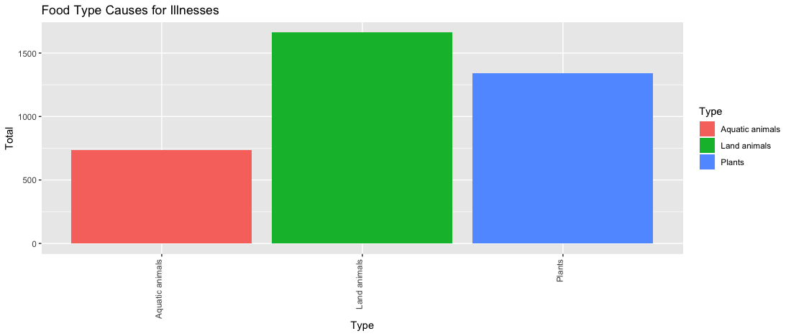
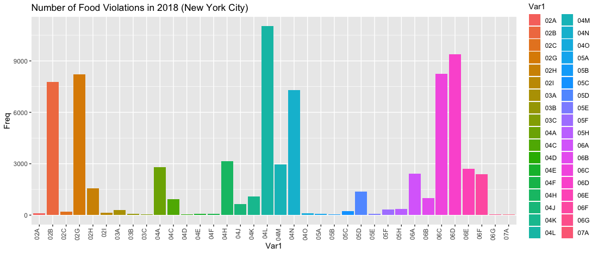
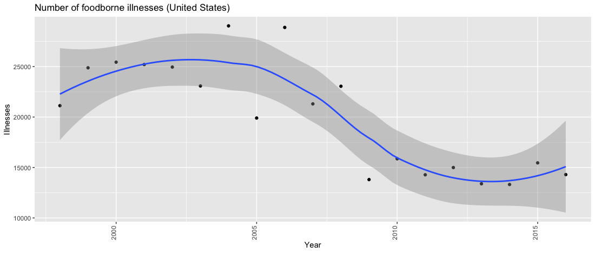
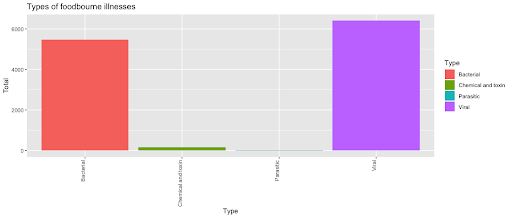

# CS301 Final Project - Final Report
#### Group Members: Nick Tocci, Christian Lussier, Ben Watto, Dillon Thoma
#### 14 December 2018

## Final Report
### Introduction
<!-- Intro -- what is our project about? what are we looking at within this scope? -->
Foodborne illnesses are very prevalent in today's society because of their wide reach. Food is obviously a necessity to survive and any foodborne illnesses that affect a major food source can have potentially catastrophic effects. A paper by Scallan, Elaine, et al., says that by using a variety of methods and sources, an estimated 31 major pathogens cause 9.4 million cases of foodborne illnesses yearly in the United States. These illnesses can have effects that range from mild sickness to death. Additionally, in a world of ever-changing politics, according to Scallan, "estimates of foodborne illnesses can be used to direct food safety policy and interventions." As a result, our group will look into the ideas that should be included in a policy regarding foodborne illness. Foodborne illnesses have importance because of their widespread effects, ranging from sickness to death, to government policy issues. This means that there is a lot of online data on the subject and by using RStudio we will try to answer several research questions regarding foodborne illness. Our project specifically looks to analyze trends regarding these prevalent foodborne illnesses and try to answer the question of whether there is a correlation between the production of food and the number of foodborne illnesses. Additionally, our project will try to look into data regarding the number of foodborne illnesses today versus these same illnesses in the past in an attempt to see if there are differences between the two and if these illnesses are handled better today. In order to answer these questions, our group has used online datasets, which we analyzed and looked at in-depth using RStudio and R programming concepts discussed in CS301. After analyzing these different views of our data that coding in RStudio can provide, we have come to several conclusions regarding trends and causes of foodborne illnesses.

### Background
<!-- Background information -- what are foodborne illnesses? -->
We have completed extensive research on our project's background in order to ensure we have a solid understanding of our topic. Foodborne illnesses are, quite simply, illnesses that are caused by food products in some capacity. According to Fein, Sara B., C-T Jordan Lin, and Alan S. Levy, "consumers play an essential role in foodborne illness prevention." This is because they handle food they prepare themselves and decide if they should eat food that could cause foodborne illnesses, like undercooked meat (Fein, Sara B., C-T Jordan Lin, and Alan S. Levy). Though this can help prevent foodborne illnesses it can also cause them. Most people are not professional chefs and as a result, they may prepare food in a way that is more likely to cause foodborne illnesses. Additionally, consumers obviously choose whether or not to eat something, so they are essentially choosing if they want to increase their risk of catching a foodborne disease. This may be why foodborne illnesses are very common in today's society. In fact, foodborne illnesses cause around 48 million cases of foodborne illnesses in the United States each year, which is equivalent to sickening 1 in 6 Americans (FDA). Additional background research shows that foodborne illness outbreaks are the result of failures in the food system either to control known hazards or to anticipate novel hazards. A tool known as the RCA, which stands for the root cause analysis, is a systematic, analytical approach to identify the underlying reasons why an outbreak occurred. The ultimate goal of RCA is to uncover the systemic weaknesses in the food system that permitted its breakdown so the system can be redesigned in a way that prevents recurrence (Firestone, Hoelzer, Hedberg, Conroy, Guzewich). These types of studies are used to determine the cause of the outbreaks and create some awareness among consumers to help prevent the same type of outbreaks from happening in the future. With the number of foodborne illnesses that occur annually in the United States and globally, it is obvious there is still more work to be done in order to prevent these outbreaks from occurring or at least cause them to do less damage. An additional goal of our research is to see if our data provides any conclusions as to why foodborne illnesses are still so prominent in the United States, and potentially find a way to anticipate and prevent these outbreaks from occurring. After completing background research on our topic of foodborne illnesses, we learned a lot regarding how widespread these diseases are and how they are spread.

### Motivation
<!-- Motivation -- why are foodborne illnesses important? -->
There were a variety of motivating factors that went into our decision to research foodborne illnesses. Recently, there has been a large E. Coli outbreak caused by contaminated Romain lettuce. This prevalent outbreak has been talked about a lot in recent weeks and as a result, this helped to motivate our group to look into foodborne illnesses. Another motivating factor that led us to research foodborne illnesses is how widespread they are. As we mentioned earlier, foodborne illnesses cause around 48 million cases of foodborne illnesses in the United States each year (FDA). Also, about 800 foodborne disease outbreaks are reported in the United States each year (Dewey-Mattia, Daniel, et al.). When people hear the phrase foodborne illness, many just think of someone throwing up from a bad meal. While in some cases, this perception is correct, it is important to note that foodborne illnesses can cause more severe effects such as hospitalization or death. The possible severity of foodborne illnesses was a large motivating factor for our group when we were trying to decide what to research. Our background research shows that there are an estimated 128,000 hospitalizations and 3,000 deaths annually from foodborne illnesses in the United States, despite it having one of the safest foods supplies in the world (FDA). While 3,000 deaths are a small portion of the overall United States population, 3,000 is still a large number (like the 128,000 hospitalizations) which should be taken seriously. Additionally, according to Marder, Ellyn P., et al., "foodborne illness continues to be a substantial health burden." After learning how deadly and widespread foodborne illnesses are, our group was especially motivated to research them. Despite their prevalence, it seems that seemingly nothing has really changed in the area of policy creation or maintenance which could be allowing these foodborne illnesses to continue to thrive. Solid research made in the area of foodborne illness could help us understand these illnesses origins and help find ways to stop them from starting and spreading, which could help to prevent deaths and hospitalizations. We were motivated to complete research in the area of foodborne illnesses because of a lack of change in their care and their overall importance stemming from their wide reach and potentially devastating effects.

### Main Research Questions
<!-- What questions does our project aim to answer? -->
There are many questions that we could ask and try to answer when it comes to the area of foodborne illnesses. The main question that we originally tried to answer is: Is there a correlation between the production of food and illnesses? We believed this question to be important because if there is a correlation between the two when there is an increase, this shows that the food industry needs to be more heavily regulated. We then narrowed this question down to be more specific. There are several other questions that are subquestions of a sort to the main questions that our group examined. One of these questions that we have is: Which food groups cause the most foodborne illnesses? This question is important because if specific food groups are causing foodborne illnesses maybe people will start eating them less or maybe more research and regulation will occur for these food groups. For example, in the dairy industry foodborne pathogens were found in milk and other dairy products because of contaminated farm equipment, infected cows, and more (Hati, Subrota, Kunal Gawai, and V. Sreeeja). If people knew that foodborne illnesses could be caused by dairy products, maybe they wouldn't consume as many. Additionally, we look to find out which foodborne illnesses are the most prevalent? This question is somewhat similar to the others, but it is still important because by answering it we could possibly see what causes these illnesses and determine steps to prevent outbreaks of them. Thoroughly answering these questions could help us learn more valuable information about the area of foodborne illnesses.

### Approach
<!-- Approach -- how did we do our project? -->
In order to complete this project, we used a variety of approaches in order to complete meaningful research and analysis. One approach we took during this project was to compare all the data we found over the years rather than just a single year to provide a more in-depth analysis. In doing so, we analyzed data such as how food production changed over the years in the United States, as well as how foodborne illnesses increased or decreased over the years in the United States. We also created a breakdown of the types of illnesses that were most prevalent, along with the locations in which they occur. This allowed us to pinpoint the areas in which foodborne illnesses (and specific types of these illnesses) were occurring most often. This information ultimately allowed us to be able to adjust and create policies that could help prevent specific outbreaks in specific locations. We then had to determine the main cause of the contamination, which we broke down into the types of food that caused the most illnesses. This allowed us to find the main types of food, whether it be land animals, sea animals, or plants, that were causing the most illnesses. This information also goes along with the data mentioned previously in the fact that it helps us to think of specific solutions to solve the problem of widespread  foodborne illness outbreaks.

### Challenges
<!-- Challenges -- what challenges did we face? how did we overcome them? -->
We faced a variety of challenges while completing this project. One of the biggest challenges was finding data to analyze. While there is a lot of data available data in the area of foodborne illness, it was hard to find data for the specific ideas we had such as analyzing specific diseases like E. coli and salmonella. When we finally found data that was useful, a lot of it was spread out between different datasets, such as Salmonella data on the CDC website which was spread over about 7-10 datasets. This created extra work as we had to combine smaller datasets to one large dataset that we could analyze. Another big challenge was getting the data into the correct format. We found a lot of datasets that were in PDF format needing to be converted to CSV format so we could import it into RStudio and perform the analyses. This leads to another challenge of deciding what graphs to use when analyzing the data in R Studio, whether it be linear regression models, correlation plots, bar graphs, or something different. Another challenge we faced was that the dataset we found and felt it would be our main dataset when beginning the project was not extremely useful to our overall main question. Initially, we saw this as a problem because we had converted a large dataset basically by hand and we were unable to use a lot of it to answer our question. However, after further analysis, we were able to alter the scope of our research question, as well as add some sub-questions that allowed us to connect this data to our project. Similarly, in our proposal comments, we were suggested to look at specific diseases such as E. coli and salmonella. This created an issue in that there was not much easily accessible data over the years for these single illnesses, but rather types of illnesses such as viral, bacterial, etc. The solution to this problem was analyzing the data based on the larger illness type which ultimately showed the most prevalent and dangerous types of foodborne illnesses. Though we faced a variety of challenges during the completion of this project, we were able to overcome them by doing online research and working hard to manually convert datasets.

### Analysis
<!-- Analysis -- What do our results mean? -->

We wanted to see what the breakdown for the types of foodborne illnesses is. This information will indicate the types of food that are being neglected during the production phases. We found that land animals are the food type associated with the highest amount of illnesses, with plants coming in at a close second. Land animals being the highest cause of foodborne illnesses points to two different possibilities for the reasons as to why this could be. The two possible reasons are that the amount of food production incurring an increase could mean that there is an issue with the meat itself. The other reason indicates that there is an issue with the handling of food by restaurants, something we will discuss further in the coming paragraphs.

As indicated in the past portion of the analysis, we believed that restaurants were a very large part of the issue. This is supported by the breakdown of the locations that foodborne illnesses occur. Restaurants are very clearly the largest percentage of where the problem lies, with another similar food distribution location with a catering or banquet facility being the second choice. This information leads us to believe that the collection of food, such as at a farm, is not the main cause of foodborne illnesses.

This is further supported by the number of food violations and what they are based around. We used data from New York City that had explanations on inspection information from a variety of the city's many restaurants. We further trimmed the data down from all cases to just cases that occurred in 2018 and were critical. The number of issues were still astronomical. The number of issues labeled 04L (mice found in food production areas or food storage) was over 9000 cases. The next section of the bars that we looked into concerned 06D (Food contact surface not properly washed, rinsed and sanitized after each use and following any activity when contamination may have occurred). This number also reached over 9000 instances. The final big section that we looked to was 02G (Cold food item held above 41 F (smoked fish and reduced oxygen packaged foods above 38 F) except during necessary preparation). This was very important information as it showed that land animal foods, which were the highest cause of foodborne illnesses, were being improperly stored by food preparers.

The food violation graph can become very scary when compared to this one. This graph is a representation of the Food and Beverage Sales for the United States in Billions. When compared to the previous bar chart, it is easy to see that even though there are a large number of restaurant violations, people will still continue to eat at restaurants instead of preparing their own food. This undoubtedly causes foodborne illnesses to skyrocket.

This graph indicates that the number of illnesses can fluctuate and it seems that much of this can be predicated on negligence. As violations occur or large outbreaks are reported, people get scared and begin to either eat certain foods or will prepare many of their own meals. However, after some time, people get lazy or forget to continue to prepare food safely and properly. Another large cause for the upswing is that it can become easy to do the wrong thing. People may not be paid enough to clean things properly, so mice come or the kitchen can become filthy. As a result, it seems easily preventable negligence is a large cause of foodborne illnesses.

These graphs show the distribution of the different types of foodborne illnesses. From this graph, it is clear to see that the most amount of illnesses are viral based and with a very close second being bacterial despite the fact that both be stopped with the proper handling of food.

Overall, it seems many foodborne illnesses are not being caused by the collection of the actual food. Instead many foodborne illnesses are caused by eating at restaurants because of negligence by restaurant staff. Foodborne illnesses can occur at home for the same reason.

### Results
<!-- Results -- what did we find? -->
One of the major findings we achieved from our analyses is that the main location of foodborne illnesses are restaurants. Many of the illnesses occur from establishments not properly storing food that need to be kept cold or mice being present in places of storage for food. Additionally, we performed a specific study on restaurants in New York City where unique foodborne illness cases occurred. The data was quite surprising, as the numbers were extremely high. There were over 9,000 unique occurrences of mice being found in the food storage rooms or cooking areas. Also, there were over 9,000 unique cases of foodborne illnesses occurring due to utensils and counters not being cleaned properly before preparing or consuming food. One final 'highlight' of this data is that there were just under 9,000 unique cases of frozen food being stored in temperatures of greater than 40 degrees Fahrenheit, which is obviously not freezing. These findings truly are just the beginning of this analysis as the graph related to these results is extremely trimmed down so it is only from inspections in 2018 in New York City restaurants with only unique or critical cases. We can only imagine how much these numbers would skyrocket if we looked at data from, for example, all cases in the United States for a set range of years.

### Policy Change
<!-- Our Policy Change -- based on our results an analysis, we think that this should happen with policies. -->
According to Thomas, M. Kate, et al., "Estimates of foodborne illness are important for setting food safety priorities and making public health policies." Right now, there are several policies that cover foodborne illnesses, pathogens, and the like. However, many of these policies are quite small in their scope and are more reactive than proactive. As a result, our group feels it may be a good idea to consider creating a new, broader and more encompassing, policy to help prevent foodborne illnesses. This policy would be more proactive in that it would attempt to stop foodborne illnesses from happening altogether by heavily regulating the food industry. This policy could check one item from every batch (or harvest) of a food item. The policy could also call for random checks on food industry manufacturer's plants. These measures would help to stop foodborne illnesses from even leaving the factory. Additionally, if a product hits the shelves and is causing a foodborne illness, every individual item should be recalled (not just the items from one batch, which is what is currently done most of the time) and the product's manufacturer should be heavily investigated. This would help limit the spreading of foodborne diseases and hopefully stop them from happening again in the future. Such a policy would do more to regulate the important food industry in an attempt to prevent the spread of foodborne illnesses.

As we mentioned earlier, our group found that restaurants are a major place of origination for foodborne illnesses despite heavy regulations on the foodservice industry. As a result, our group would also like to introduce potential policy change that would more heavily regulate the foodservice industry. This policy would involve more regular inspections from the health department for restaurants. After doing analysis on data about health code violations in the foodservice industry in New York City, we found that a variety of codes that would likely not have occurred with more heavy regulation, such as frozen foods being stored above freezing. With these more regular health department inspections for restaurants, policy should be implemented to have inspectors look out for dangerous policy violations. For instance, inspectors should look closer at stored foods, making sure they are not expired, that there is no cross-contamination, that they are being stored at the correct temperature, and that there are no hazardous organisms like rats in the food storage area. With these more frequent and in-depth inspections, policy should become more strict towards repeat offenders. Our group believes that if a restaurant is found to have health code violations for the same thing(s) more than twice in a short span, they should be considered to be repeat offenders and the restaurant should be shut down or temporarily closed. If a temporarily closed restaurant is permitted to reopen and does not improve, they should be closed down for good. Stricter policies on restaurants would help stop the spread of foodborne illnesses.

### Conclusion
<!-- Conclusion -->
Foodborne illnesses are a very prevalent type of illness in today's society. They are important because of how widespread they are, how many different pathogens there are, how many illnesses and deaths they cause, and much more. Our group looked to answer the question of is there a correlation between the production of food and illnesses? We also answered a variety of other questions relating to foodborne illnesses and pathogens. From our research and analysis we found that it seems that most foodborne illnesses and outbreaks do not originate from the food source or collection method, but they instead have their origins in the area of food preparation where negligence is common, especially in restaurants. This led our group to come up with several possible policy ideas, most specifically in the area of higher restaurant standards in an attempt to stop the spread of foodborne illnesses. If we had more time, we also would have liked to try to answer the question: In which countries are foodborne pathogens and illnesses most prevalent? This question is important because it would allow us to see, for example, if foodborne illnesses are more common in poorer countries. We could also ask the question: Which age group is most affected by foodborne illnesses? Thoroughly answering these questions could help us learn more valuable information about the area of foodborne illnesses. Additionally, because of the prevalence of foodborne illness in politics, our group proposed possible policy ideas that could help prevent foodborne illness cases such as increased regulation on food retailers and restaurants. Despite some challenges, by finding online datasets and performing analysis of this data in a variety of different ways in RStudio, our group was able to perform a data analysis on foodborne illnesses and come up with ideas for policy changes to prevent them.

## References
Dewey-Mattia, Daniel, et al. "Surveillance for Foodborne Disease Outbreaks—United States, 2009–2015." MMWR Surveillance Summaries 67.10 (2018): 1.

FDA. "Foodborne Illnesses: What You Need to Know." (2018): 1.

Fein, Sara B., C-T. Jordan Lin, and Alan S. Levy. "Foodborne illness: Perceptions, experience, and preventive behaviors in the United States." Journal of Food Protection 58.12 (1995): 1405-1411.

Firestone, Hoelzer, Hedberg, Conroy, Guzewich. "Leveraging Current Opportunities to Communicate Lessons Learned from Root Cause Analysis to Prevent Foodborne Illness Outbreaks." 38.2 (2018): 134-138

Marder, Ellyn P., et al. "Preliminary Incidence and Trends of Infections with Pathogens Transmitted Commonly Through Food—Foodborne Diseases Active Surveillance Network, 10 US Sites, 2006–2017." Morbidity and Mortality Weekly Report 67.11 (2018): 324.

Scallan, Elaine, et al. "Foodborne illness acquired in the United States—major pathogens." Emerging infectious diseases 17.1 (2011): 7.

Thomas, M. Kate, et al. "Estimates of the burden of foodborne illness in Canada for 30 specified pathogens and unspecified agents, circa 2006." Foodborne pathogens and disease 10.7 (2013): 639-648.

### Main Datasets Used
- Surveillance for Foodborne Disease Outbreaks United States, 2016: https://www.cdc.gov/fdoss/pdf/2016_FoodBorneOutbreaks_508.pdf
- Food and Beverage Sale Rates in the US: https://www.statista.com/statistics/197619/annual-food-and-beverage-store-sales-in-the-us-since-1992/
- Food Production Index Data: https://data.worldbank.org/indicator/AG.PRD.FOOD.XD
- NORS National Foodborne Illness/Outbreak/Hospitalizations/Deaths in the US Data (1992-2017): https://wwwn.cdc.gov/norsdashboard/
- Annual Reports Foodborne Data in the US Data: https://www.cdc.gov/fdoss/annual-reports/index.html
  - Salmonella data, E. Coli data, foodborne illness/outbreak data from restaurants, and more were found from a variety of datasets located on this webpage.
- New York Food Violation Data: https://catalog.data.gov/dataset/dohmh-new-york-city-restaurant-inspection-results
